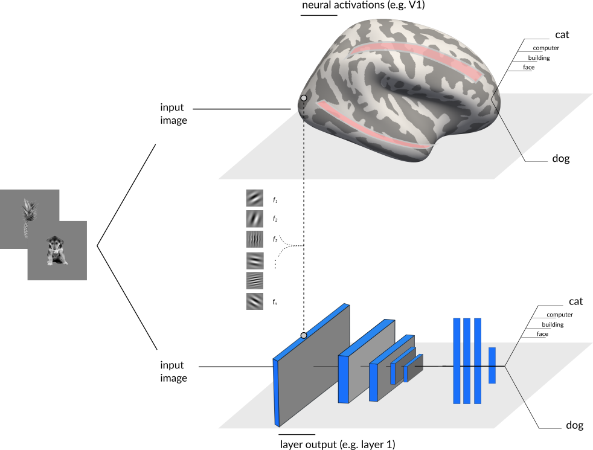

Week 3 deliverable : 

 
# Summary

I'm a PhD student at Université de Montréal & University of Birmingham (UK). I use an aggregate of psychophysics, EEG, and computational techniques to understand individual differences in vision, specifically in object/face recognition.

The practical objectives of this project were to develop skills in Python, data visualisation and developping better coding habits with Github. 

The general aim of this project is to understand and visualize how deep neural networks represent visual stimuli compared to our brain. For human representations, we will use high-density EEG signal from a simple visual task.
 
 
The project will unfold in three steps. 

1) Create a custom deep convolutional neural network (DCNN; using  TensorFlow & Keras). 
2) Create, from high-density EEG time series, group-averaged representational dissimialrity matrices (RDMs; we will be feeding eeg topographies to linear classifers to do so).
3) Compare the representations (RDMs) from each of the DCNNs' layers to human brain representations (RDMs) unfolding in time. 

The first two steps will be developped in parallel. The last step will integrate their output.

Initially, the plan was to train from scratch a DCNN to "learn" more human/brain representations; but this was too ambitious and I chose to focus on learning programming tools (described below).

# Project definition
# Background

The idea of comparing and restraining a DCNN  weight representations is highly inspired by work from [Cichy et al., (2016)](https://www.nature.com/articles/srep27755)
[Kietzmann et al., (2019)](https://www.pnas.org/content/116/43/21854).

Deep neural networks (DNNs) encodes information in a similar way to the visual brain (e.g. primary visual cortex V1 encodes similar information than convolutional filters in the first layer of a DNN). 
The idea here is to come up with a common measure of processing between DCNN and brain imaging signal, here electroencephalogrpahy (EEG), and link the computations in both modalities. 

A good sumary of brain and DNN computations can be obtained with a Representational Dissimlarity Matrix (RDM).

# Tools

The structure of the analyses will rely on :

- developping analysis in Python scripts: pyrsa, scikit-learn, tensorFlow & keras
- basics in visualisation tools : using jupyter notebooks, interactive widgets, seaborn, and scikit-learn for multi-dimensional scaling.  
- Considering that the data is not completely available, no need to focus on BIDS standards that much.

# Data

Description (general): 

we previously used brain EEG data to "decode" pairs of images (faces, objects, scenes, animals, etc.) that were presented to human participants.
By doing this with all pairs of images presented (49 stimuli = 1178 pairs), we created a Dissimilarity Matrix that is a summary of how the brain of each participant encodes diverse visual stimuli.
This Representational Dissimilarity Matrix (RDM) was used as the base data input of this project.

-RDMs were averaged across particpants (N=23). Preprocessed EEG recordings at 128 electrodes (BioSemi)

Task: simple one-back task over a stream of images containing faces of different emotions/gender, human-made/natural objects, animals and scenes. 

# Deliverables

The plan is to have at least: 

- Python scripts for steps 1 and 3
- Markdown README.md explaining the whole pipeline.

And perhaps :

- A contained that enables to reproduce these analyses

# Results
## human brain RDMs

An interactive visualisation of the human brain data (RDMs) can be found in the following jupyter notebook :

Results for group-average **Representational Dissimiarlity matrices (RDMs)** have been derived at every time step from image onset. These are shown in 
Each of this *stimulus* x *stimulus* matrix indicates the brain's representational model for various visual stimui.

2D coordinates of the representational distances from the RDMs are computed  "online" using Multi-Dimensional Scaling (MDS) from sklearn MDS method.

## DNN representations and link with brain data

I computed an RDM for every layer of the VGG16 neural network (weights from imagenet)

By correlating these DNN representations with the human RDMs, we obtain a time course of similarity between VGG16 hierarchical processing and the EEG brain visual representations.

# Progress overview
 This project was first initiated the 19th of May 2020 by Simon Faghel-Soubeyrand as a part of the Brain Hack SChool.

# Tools I learned during this project

  Using many Python libraries through implementing DNNs representations, flexible data visualisation, and link between brain and DNN computations. 

# Conclusion and acknowledgements
 TBD
