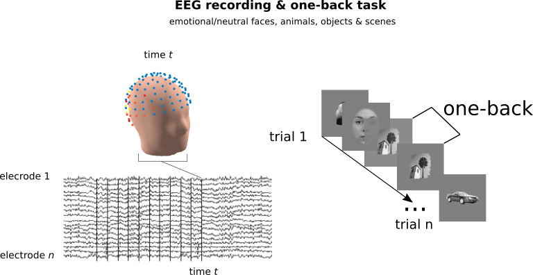
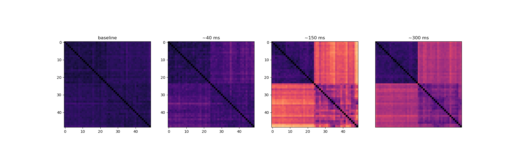

# Summary

I'm a PhD student at Université de Montréal. I use an aggregate of psychophysics, EEG, and computational techniques to understand individual differences in vision, specifically in object/face recognition.

The practical objectives of this project were to develop skills in Python, data visualisation and developping better coding habits with Github. 

The general aim of this project is to understand and visualize how deep neural networks represent visual stimuli compared to our brain. For human representations, we will be using high-density EEG signal from a simple visual task. 

 
The project will unfold in three steps. 

1) Create a custom deep convolutional neural network (DCNN; using  TensorFlow & Keras). 
2) Create, from high-density EEG time series, group-averaged representational dissimialrity matrices (RDMs; we will be feeding eeg topographies to linear classifers to do so).
3) Compare the representations (RDMs) from each of the DCNNs' layers to human brain representations (RDMs) unfolding in time. 

The first two steps will be developped in parallel. The last step will integrate their output.

Initially, it was planned to train from scratch a DCNN to "learn" more human/brain representations; but this was too ambitious and I chose to focus on learning programming tools (described below).

# Project definition
# Background

The idea of comparing and restraining a DCNN  weight representations is highly inspired by work from Cichy et al., (2016) and Kietzmann et al., (2019;PNAS). 

[Cichy et al., (2016)](https://www.nature.com/articles/srep27755)
[Kietzmann et al., (2019)](https://www.pnas.org/content/116/43/21854)

In essence, we already know that DCNNs encodes information in a similar (hierarchical) way than our brain.

 
The idea here is to come up with a common measure of processing in DCNN that is comparable to brain imaging signal (here EEG). 
A good sumary of brain and DCNN computations can be obtained with a Representational Dissimlarity Matrix (RDM).

To obtain an RDM for a DCNN, we can feed the same images that were shown to the brain of human participants, and to look at the activation of the layers of the network.
 

# Tools

The structure of the analyses will rely on :

- developping analysis in Python scripts: pyrsa, scikit-learn, tensorFlow & keras
- basics in visualisation tools : using jupyter notebooks, interactive widgets, seaborn, and scikit-learn for multi-dimensional scaling.  
- Considering that the data is not completely available, no need to focus on BIDS standards that much.

# Data

Description (general): 

we previously used brain EEG data to "decode" pairs of images (faces, objects, scenes, animals, etc.) we presented to human participants.
By doing this with all pairs of images presented (49 stimuli = 1178 pairs), we created a Dissimilarity Matrix that is a summary of how the brain of each participant encodes diverse visual stimuli.
This Representational Dissimilarity Matrix (RDM) was used as the base data input of this project.

Deep neural networks (DNNs) encodes information in a similar way to the visual brain to categorize images; "they" activate more or less specific neurons depending on what they are presented with, and makes a decision ("This is a dog").
Using RDMs to model human and DNN data was not an accident: it is useful because it enables us to have a similar format in which we can combine both human and "machine" representations

-RDMs were averaged across particpants (N=23).
   

Description specifics : N = 23 neurotypical human participants; preprocessed EEG recordings (128 electrodes BioSemi); 
~3200 trials per particpant (total trials ~= 73,000).

Task: participants completed a simple one-back task over a stream of images containing faces of different emotions/gender, human-made/natural objects, animals and scenes.
They had to answer (key press) whenever two identical images were shown in a row (e.g. imgA-imgZ-imgR-**imgR**).

# Deliverables

The plan is to have at least: 

- Python scripts for steps 1 and 3
- Markdown README.md explaining the whole pipeline.

And perhaps :

- A contained that enables to reproduce these analyses

# Results

**Representational Dissimiarlity matrices (RDMs)** have been derived at each time step, and averaged across participants. 
Each of this *stimulus* x *stimulus* matrix indicates the brain's representational model for various visual stimui.

2D coordinates of the representational distances from the RDMs of 3 subjects groups were derived with Multi-Dimensional Scaling (MDS).

# Progress overview
 This project was first initiated the 19th of May 2020 by Simon Faghel-Soubeyrand as a part of the Brain Hack SChool.

# Tools I learned during this project
 TBD
# Conclusion and acknowledgements
 TBD
